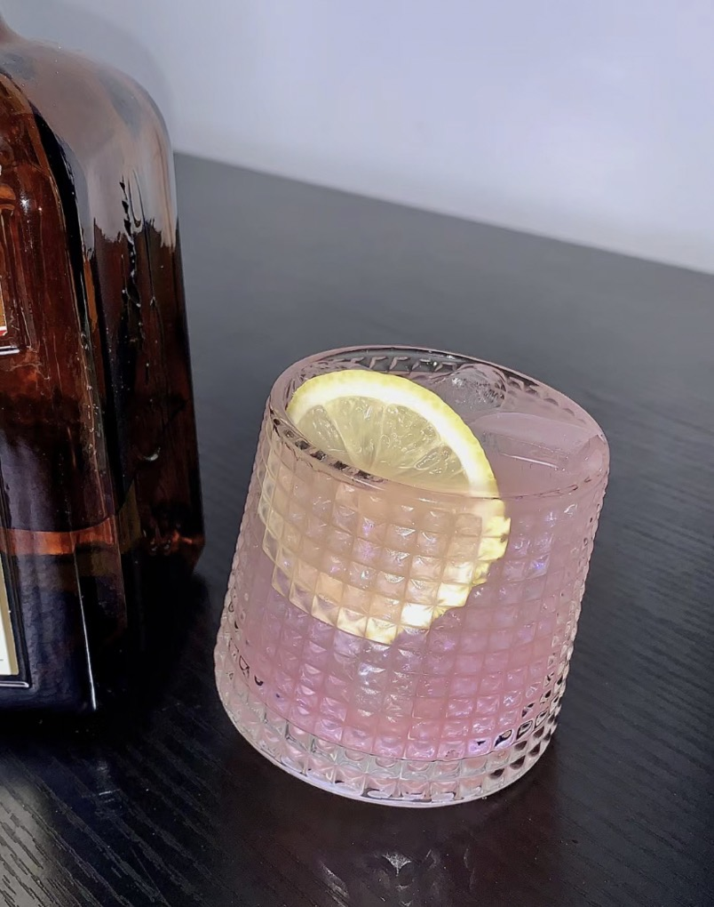
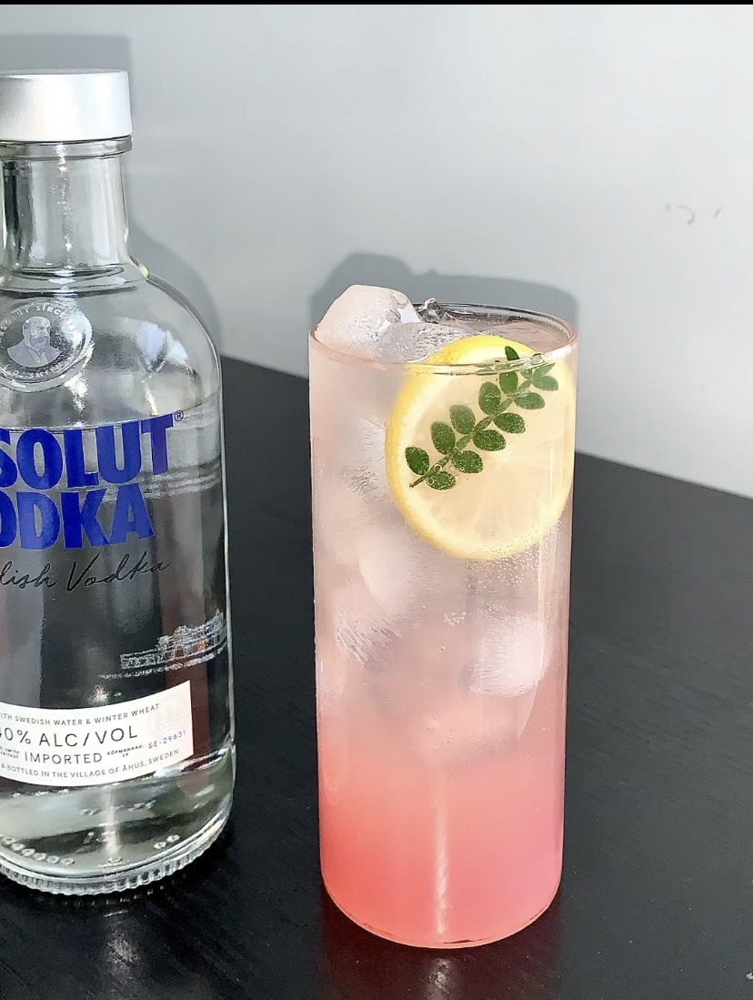
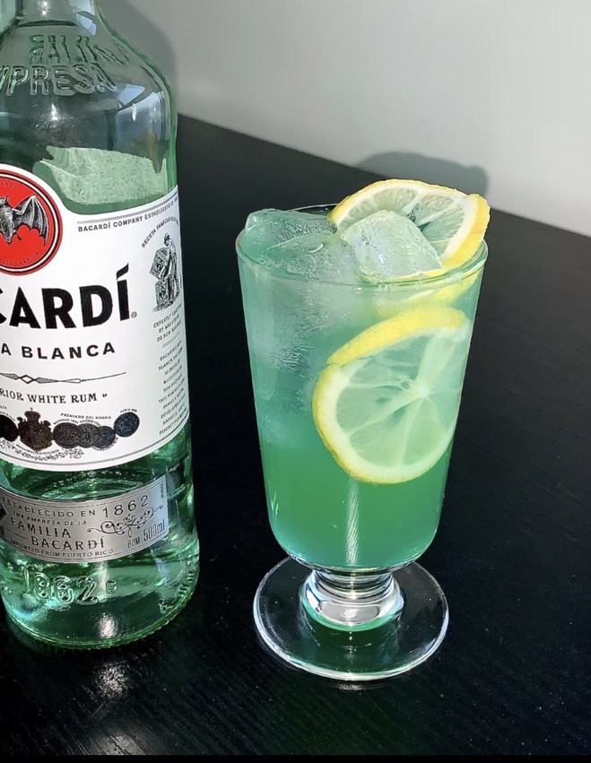
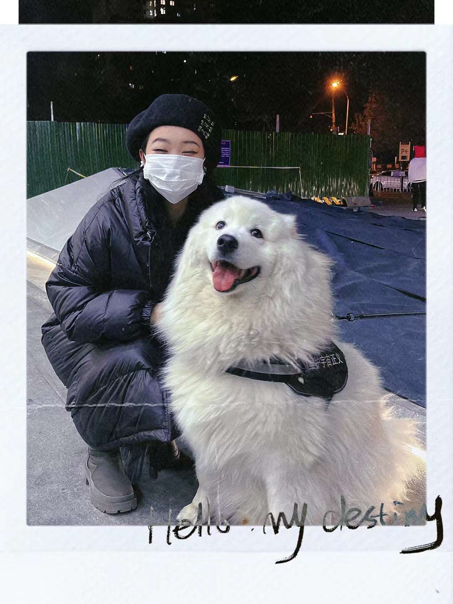

# Hobbies

## Drawing

 

 I have a strong passion for both oil and acrylic painting. Textured painting techniques can add interesting textures and layers to my artwork. What I love about painting is its ability to express my emotions and release my feelings. Hiking, on the other hand, provides me with a wealth of inspiration. When I'm creating art, I can immerse myself in the beauty of nature, which helps me discover and appreciate the many wonderful aspects and surprises of daily life.

## Bartending

 

I enjoy mixology. At first, I found cocktails to be visually appealing and thought they were perfect as sweet and delightful drinks for women. However, it was during a casual night out at a cocktail bar when, after a conversation, I discovered the stories behind each cocktail. I realized that a drink like the Dry Martini has a history spanning a hundred years, and the Mojito, aside from being enjoyed by Jay Chou, was also a favorite of Ernest Hemingway. Having a few drinks in moderation can indeed be quite therapeutic!

## My Dog

This is my love. Her name is Meituan.

 

